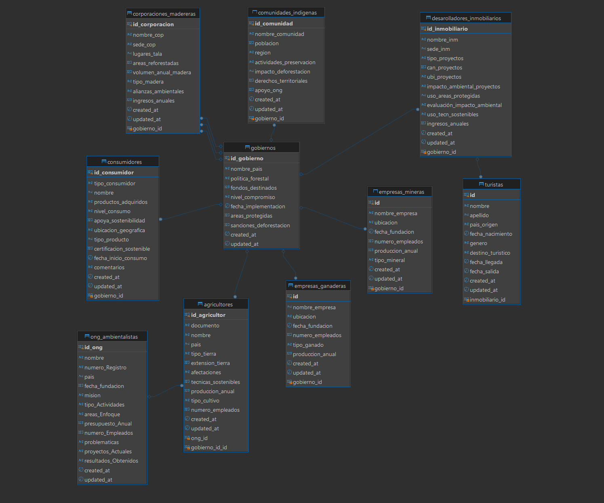

# Ejemplo de base de datos para la deforestación y destruccion de habitats naturales

## Descripción y contexto

Este repositorio contiene un ejemplo de base de datos para la deforestación y destrucción de habitats naturales. El objetivo es proporcionar una base de datos clara y concisa para el análisis y la visualización de datos relacionados con la deforestación y destrucción de habitats naturales.

**Table of Contents**
- [Descripción y contexto](#descripción-y-contexto)
- [Problema a abordar](#problema-a-abordar)
- [Estructura de la base de datos](#estructura-de-la-base-de-datos)
- [Herramientas y tecnologías utilizadas](#herramientas-y-tecnologías-utilizadas)
## Problema a abordar
La deforestación en áreas tropicales está siendo impulsada por la expansión agrícola y ganadera,
así como por la explotación de recursos naturales como la madera y minerales. Corporaciones madereras y 
empresas mineras están obteniendo permisos de explotación de parte de los gobiernos, a menudo sin considerar
el impacto ambiental y sin consultar a las comunidades indígenas que dependen de estos hábitats para su sustento
y cultura. La creciente demanda de tierras para la agricultura y ganadería también incentiva la destrucción de
áreas boscosas, mientras que desarrolladores inmobiliarios promueven la urbanización de estos territorios
para atender el crecimiento de la población y el turismo.

Organizaciones no gubernamentales ambientalistas intentan contrarrestar esta situación promoviendo prácticas
sostenibles y concienciando a los consumidores sobre el impacto de sus decisiones. Sin embargo,
el poder económico de las grandes corporaciones y la falta de regulación efectiva limitan la capacidad
de estas organizaciones para detener la pérdida de biodiversidad y la degradación de los ecosistemas.

## Estructura de la base de datos

La base de datos está dividida en 10 tablas principales:

- `corporaciones_madereras`: Contiene información sobre las corporaciones madreras que han participado en la deforestación y destrucción de habitats naturales.
- `desarolladores_inmobiliarios`: Contiene información sobre los desarrolladores inmobiliarios que han participado en la deforestación y destrucción de habitats naturales.
- `empresas_ganaderas`: Contiene información sobre las empresas ganaderas que han participado en la deforestación y destrucción de habitats naturales.
- `empresas_mineras`: Contiene información sobre las empresas mineras que han participado en la deforestación y destrucción de habitats naturales.
- `gobiernos`: Contiene información sobre los gobiernos que han implementado medidas para la deforestación y destrucción de habitats naturales.
- `ong_ambientalistas`: Contiene información sobre las ONGs ambientalistas que han implementado medidas para la deforestación y destrucción de habitats naturales.
- `consumidores`: Contiene información sobre los consumidores que han utilizado los medios ambientales para reducir su impacto ambiental.
- `agricultores`: Contiene información sobre los agricultores que han utilizado los medios ambientales para reducir su impacto ambiental.
- `comunidades_indigenas`: Contiene información sobre las comunidades indígenas que dependen de los hábitats naturales para su sustento y cultura.
- `turistas`: Contiene información sobre los turistas que han utilizado los medios ambientales para reducir su impacto ambiental.

## Herramientas y tecnologías utilizadas

- MySQL: Es una base de datos relacional de código abierto que se utiliza para almacenar y gestionar datos estructurados.

## Modelo relacional 
